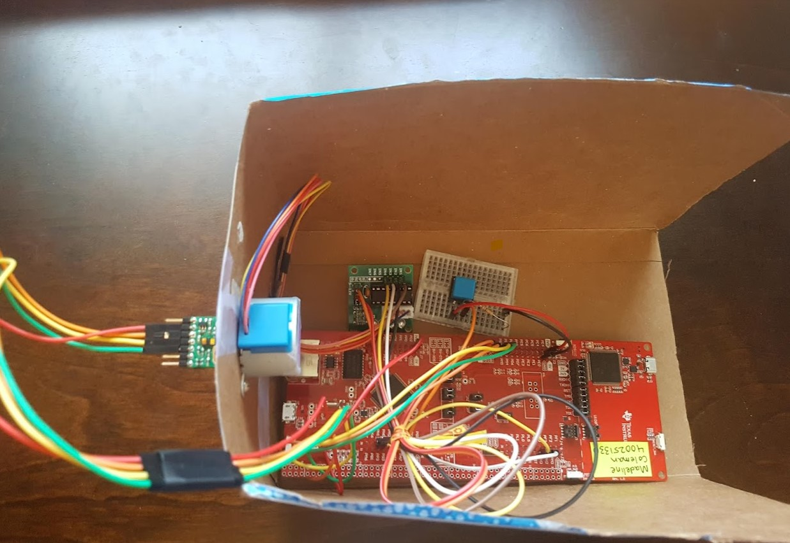
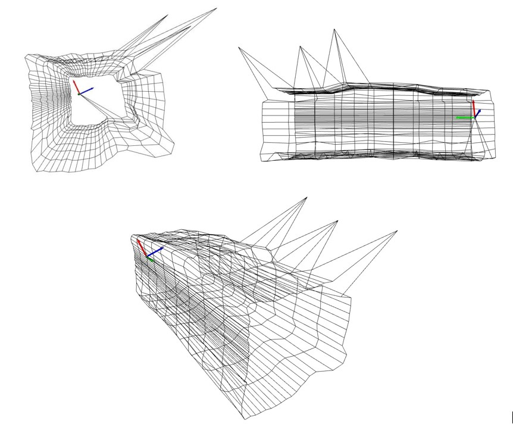

This is a room scanning system scans a 3D space and creates an interactive of the scanned area. The system uses a TI MSP432E401Y microconroller, stepper motor, and LIDAR sensor to gather data. 

*Data Collection Setup*

The microcontroller, which is programmed in C, uses serial communciation to send the collected data to a Python program, which uses the Open3D library to create an interactive point cloud.

*Expected Scanned Output*

*Point Cloud Output*

